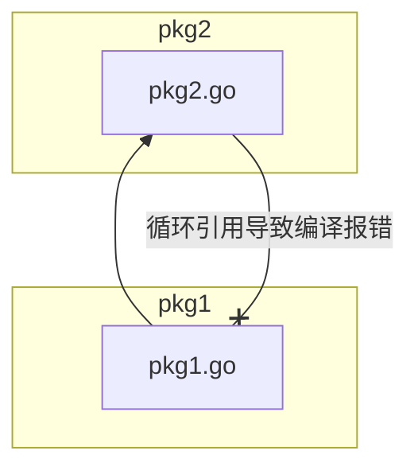
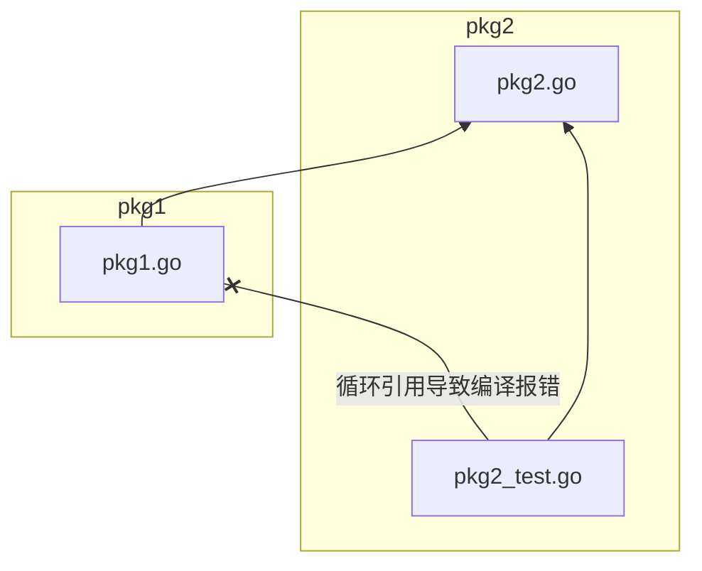
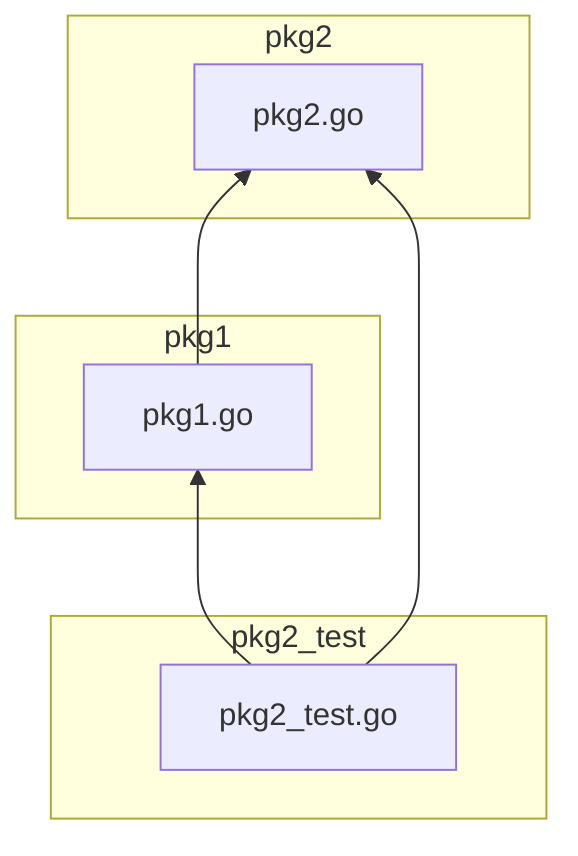

# Hello World

## 课程要点

1. 创建并编译运行第一个Golang程序
2. 了解Go Module包管理系统
3. 使用`fmt.Println`与`println`函数分别打印`hello world`，并了解它们的异同
4. 了解`fmt.Printf`格式化输出
5. 将Golang代码编译为汇编代码
6. 对Golang二进制文件进行反汇编
7. 了解交叉编译

## 课程内容

### 创建项目

按照Go语言的约定，一般我们在`$GOPATH`目录下的`src`目录中新建我们项目，
比如GitHub上的项目如果下载到本地一般会放在`$GOPATH/src/github.com/username/repository`目录下。

在本教程中，我们把所有的示例代码都放在这个仓库中：[github.com/go-book/go-programming-book-code](https://github.com/go-book/go-programming-book-code)

首先我们新建好我们的仓库目录，即`$GOPATH/src/go-book/go-programming-book-code`

```bash
mkdir -p $GOPATH/src/go-book/go-programming-book-code
```

### 初始化项目

创建好仓库目录之后，进入仓库的根目录，执行`go mod init`命令来初始化我们的仓库

```bash
cd $GOPATH/src/go-book/go-programming-book-code
go mod init
```

此时项目的根目录会自动生成一个`go.mod`文件，代表着我们使用Go Module的方式来管理整个项目的依赖关系，
这是当前推荐并且是默认的包管理方式。

除此之外还有通过`GOPATH`和`Go Vendor`来进行依赖包的管理，
不过一般不建议使用，除非是老的遗留项目，或者一些特殊情况下，才会使用老的包管理方式进行依赖包的引用。

以下是`go.mod`文件中的内容，其中第一行指定了当前项目的模块名称。
如果你使用`go1.21.0`及以上的版本，最后一行`go 1.21.5`代表着本项目运行的最小Golang版本号，
若当前的Golang版本小于这里指定的版本，当前编译器会自动下载指定的版本进行后续编译工作。

```text
module github.com/go-book/go-programming-book-code

go 1.21.5
```

至此，我们的第一个Go项目就初始化好了，是不是超级简单，目前就只有一个`go.mod`文件。

### 编码实现

因为这个仓库中后续会放很多的示例，所以我们把每一个示例都放在一个单独的子目录中，
在Golang中每一个目录都是一个单独的包(package)。

```bash
mkdir hello_world
cd hello_world
```

现在就可以正式开始写我们的Hello World程序了，新建一个`main.go`文件，输入以下内容

```go
package main

import "fmt"

func main() {
	fmt.Println("hello world")
}
```

如上所示，我们的第一个Golang版本的Hello World程序就写完了，十分的简单。

现在该到了见证奇迹的时刻了，来看看我们的成果吧。

直接执行以下命令就可以编译并运行我们的第一个Golang程序了。

```bash
go run main.go
```

运行完毕后，就能在控制台中看到成功输出了`hello world`

### 代码解析

下面我们来逐步分析一下每一行代码的含义。

#### 定义包名

第一行`package main`定义了我们当前这个包的名称，一般情况下，包名会与当前目录的名称保持一致，
形成统一的代码风格，使用起来更加方便和舒心。

但是，在一些特殊情况下我们可能会打破这个约定：

1. 因为某些原因，当前目录中包含了一些特殊符号，比如`-`。此时，我们会重新约定一个包名，例如直接把`-`替换为`_`。
2. 如果当前包中包含启动函数`main`，则必须将当前包名定义为`main`，上述代码就是这种情况，我们使用`package main`
   定义包名，而不是`package hello_world`，否则`main`函数会被当作一个普通的函数，而不是程序的启动函数。

#### 包名的唯一性

关于包的定义，还有一个规则，就是一个目录下可以有多个`.go`文件，但是多个`.go`文件中包名都必须一致，也就是说一个目录下只能有一个包名。

但是有一种情况除外，那就是后面教程会提到的测试文件。

在Golang中测试文件一般是以`_test.go`结尾，里面也是普通的Golang代码。
对于以`_test.go`结尾的测试文件，可以将包名与普通代码保持一致，也可以将包名定义为当前包名，加上`_test`后缀。

比如当前这个是`main`包，我们可以将测试文件的包名定义为`main_test`，而不会导致编译报错。

除此之外，如果一个目录下程序出现多个包名，编译器则会提示错误，无法通过编译。

这里捎带提一句，为什么要搞这么一个特殊规则，不是折腾人么。
其实这是有缘由的，后续我们开发的时候也可能需要用到这个特殊情况，后面如果遇到了可以再回过头来看一下。

测试代码直接使用包名和在包名后面加上`_test`后缀分别有其应用场景。

##### 测试包名不带_test后缀

当我们需要直接测试某个包中的私有函数的时候，我们就需要将测试代码直接放在当前包名之下了，因为私有函数只能在当前包中进行调用，
如果包名不同，则不可以进行调用。

##### 测试包名带_test后缀

当然，有时候我们需要模拟正常用户的调用操作，限制测试代码直接对内部代码进行调用，使测试代码更加保真，贴近用户真实的用例，
这时就可以使用带`_test`后缀的包名来定义测试代码，在编译器层面就限制了对私有代码的直接调用，能够统一编码规范。

而且`_test`后缀的作用不仅仅这一个，还有一个更加重要的作用就是防止包直接的循环引用。
同绝大多数编程语言一样，Golang的包也是不允许进行循环引用的。
所以，如果包`pkg1`引用了`pkg2`，那么`pkg2`就不能在其内部引用`pkg1`了，否则就会造成循环引用导致编译报错，如下图所示：



但是这又跟测试代码有什么关系呢？

其实是因为在上面这个例子中，我们的`pkg1`在写测试代码的时候不会有任何问题，但是在为`pkg2`写测试代码的时候可能就会遇到问题了。
因为站在用户的层面上，`pkg1`和`pkg2`可能是需要组合在一起才能使用的。
所以在写`pkg2`的测试的时候，难以避免的就会引用到包`pkg1`，这时候冲突就产生了。



这个时候带`_test`后缀的测试包就出现了，他很好的模拟了用户所处的位置，站在一个第三方的角度对`pkg1`与`pkg2`进行调用，
这样就不会产生循环引用的问题了。



#### 导入包

接下来的`import "fmt"`这一行，有过编程经验的同学应该已经猜到了，几乎所有编程语言里都有类似的语法，就是外部包的导入。

这里我们是导入了Golang中内置的`fmt`包，用于处理一些格式化输入输出的工作。

Golang中所有的内置包都在`$GOROOT/src`目录中，有兴趣的同学可以提前概览一番，基本上所有包名都可以望文生义，
一眼就能看出来大概是做什么用的，使用的时候直接查看文档或者源码就可以了，这也是Golang比较容易上手的原因之一。

另外，对于外部的依赖包，如果使用Go Module进行管理，默认情况下都会被自动下载到`$GOPATH/pkg/mod`目录下，
我们也可以通过手动设置`GOMODCACHE`环境变量来修改依赖包的存储位置。

#### main函数

再接下来一行`func main() {`，也是相当熟悉的代码，这是一个既没有入参也没有返回值的`main`函数，其中`func`是定义函数的关键字。

需要注意的是，在这一行的末尾有一个`{`符号，这个和Java的默认风格一样，但是在Golang中这种格式是强制性的，不能像Java一样将`{`
换到新的一行里。

如果之前是使用C#进行开发的同学，可能需要适应一下，因为C#中的默认风格是将`{`另起一行。

不过也不用太在意这些区别，因为Golang已经考虑到了这一点，为了保持统一的代码风格，
Golang自带的格式化器会自动处理这些事情，时间久了就习惯了，不必刻意去记这些细节。

在Golang中，`main`函数是用户代码入口点，与C语言十分相似。

但是请注意，即使是在用户层面，`main`也不是第一个执行的函数， 每个`.go`文件中都可以定义一个无参无返回值的`init`函数。

顾名思义，`init`函数一般用于处理一些初始化的操作，所以当一个包被引用的时候，所有的`init`函数会被优先执行。

也就是说，如果当前文件中我们同时定义了`main`函数和`init`函数，`init`函数会先执行，然后才会执行`main`函数。

#### 打印字符串

接着往下看就是我们的主角，真正打印输出`hello world`字符串的代码了：`fmt.Println("hello world")`

`fmt.Println`是Golang内置的`fmt`包中的一个对外公开的打印信息到标准输出中的函数。

函数调用一般以`包名.函数名`的方式进行调用。

另外值得注意的是，在Golang中是通过函数的首字母是否是大写来判断该函数是否是对外公开可见的，
如果将函数定义为小写字母开头或者以`_`开头，
那么就意味着，该函数只能被当前定义这个函数的包内的成员访问，这个包之外的代码无法调用该函数。

与此类似，后续我们会提到结构，接口等概念同样遵循此原则。

代码的最后就是以一个`}`结尾，代表着函数的执行结束，与开头`main`函数定义中的`{`进行匹配，中间的内容就是`main`函数完整的执行体了。

#### fmt.Println

`fmt.Println`默认是写入到标准输出(`os.Stdout`)中的，这是一个全局对象，在执行写入操作的时候会执行加锁操作。

所以`fmt.Println`是并发安全的，但是不建议在高并发的生产环境中直接使用`fmt.Println`打印日志信息，
这会导致系统性能急剧降低，造成不可预知的BUG。

这在不同的编程语言中都是一个常见的问题，例如Java中的`System.out.println`也会遇到类似的问题。

#### fmt.Printf

为了更好的控制格式化输出，Golang还提供了`fmt.Printf`函数来进行格式化输出，例如：

```go
package main

import "fmt"

func main() {
	fmt.Printf("hello %s\n", "world")
}
```

常用格式化占位符如下表所示，
你也可以直接在Golang源码中查看`fmt`包下的[doc.go](https://github.com/golang/go/blob/master/src/fmt/doc.go)文件获取所有的占位符信息。

| 占位符 | 说明            |
|-----|---------------|
| %v  | 以参数值的默认形式打印   |
| %%  | 输出字面量%        |
| %t  | 打印布尔值         |
| %b  | 打印二进制         |
| %c  | 打印单个字符        |
| %d  | 打印十进制         |
| %o  | 打印八进制         |
| %O  | 打印带有0o前缀的八进制  |
| %x  | 使用小写字母打印十六进制  |
| %X  | 使用大写字母打印十六进制  |
| %U  | 打印字符的Unicode  |
| %f  | 打印浮点数         |
| %s  | 打印字符串         |
| %q  | 打印字符串，并用双引号包含 |
| %p  | 打印指针地址        |

#### println

另外Golang中还内置了`print`与`println`这两个全局函数，可以在任意地方调用，而不必引用任何包。

我们新建`hello_world2`目录，`main.go`中的代码如下所示：

```go
package main

func main() {
	println("hello world")
}
```

它们会将信息输入标准错误输出中，而且他们的实现比较简单，不支持格式化的参数，一般用于调试代码，
同样不建议在生产代码中使用它来打印日志。

而且这两个函数是由编译器实现的，所以我们没法跟`fmt.Println`一样直接通过转到定义来查看它的源代码，也没法直接对其进行调试。

### 汇编

那么就没有什么别的办法可以一探究竟了么？

当然有了，这时候我们可以使用以下命令来通过输出汇编代码来查看它的实现

```go
go tool compile -S main.go
```

下面是`main.go`文件编译为汇编代码的结果，这是Golang语言特有的一种基于plan9的汇编语言，篇幅原因省略了部分代码

```go
main.main STEXT size = 55 args = 0x0 locals= 0x18 funcid = 0x0 align = 0x0
0x0000 00000 (main.go:3)       TEXT    main.main(SB), ABIInternal, $24-0
0x0000 00000 (main.go:3)       CMPQ    SP, 16(R14)
0x0004 00004 (main.go:3)       PCDATA  $0, $-2
0x0004 00004 (main.go:3)       JLS     48
0x0006 00006 (main.go:3)       PCDATA  $0, $-1
0x0006 00006 (main.go:3)       PUSHQ   BP
0x0007 00007 (main.go:3)       MOVQ    SP, BP
0x000a 00010 (main.go:3)       SUBQ    $16, SP
0x000e 00014 (main.go:3)       FUNCDATA        $0, gclocals·g2BeySu+wFnoycgXfElmcg==(SB)
0x000e 00014 (main.go:3)       FUNCDATA        $1, gclocals·g2BeySu+wFnoycgXfElmcg==(SB)
0x000e 00014 (main.go:4)       PCDATA  $1, $0
0x000e 00014 (main.go:4)       CALL    runtime.printlock(SB)
0x0013 00019 (main.go:4)       LEAQ    go:string."hello world\n"(SB), AX
0x001a 00026 (main.go:4)       MOVL    $12, BX
0x001f 00031 (main.go:4)       NOP
0x0020 00032 (main.go:4)       CALL    runtime.printstring(SB)
0x0025 00037 (main.go:4)       CALL    runtime.printunlock(SB)
0x002a 00042 (main.go:5)       ADDQ    $16, SP
0x002e 00046 (main.go:5)       POPQ    BP
0x002f 00047 (main.go:5)       RET
0x0030 00048 (main.go:5)       NOP
0x0030 00048 (main.go:3)       PCDATA  $1, $-1
0x0030 00048 (main.go:3)       PCDATA  $0, $-2
0x0030 00048 (main.go:3)       CALL    runtime.morestack_noctxt(SB)
0x0035 00053 (main.go:3)       PCDATA  $0, $-1
0x0035 00053 (main.go:3)       JMP     0
```

从上面的输出可以看到`println`的内部实现是调用了`runtime`包的（`print.go`文件中）内部函数`printstring`实现的，
而且`println`的内部实现也是加了锁的，在`runtime.printstring`的调用的前后分别通过`runtime.printlock`
与`runtime.printunlock`来加锁和释放锁。

### 编译运行

在前面我们通过一句简单的`go run`命令就直接编译运行了我们的程序，执行很快，但是可能也很令人疑惑，这其中到底发生了什么？

众所周知，Golang是一门编译型的语言，为什么我没有看到编译后的二进制文件，我怎么把它分发给别的小伙伴呢？

接下来我们就详细说一下编译的过程和相关命令。

和其他编译型语言一样，在Golang中也可以通过一个命令，将源码文件编译成可独立分发的二进制文件，那就是`go build`命令。

```bash
go build main.go
```

编译很快就会完成，在Linux系统中我们会得到一个叫做`main`的二进制文件，直接运行就可以看到我们的`hello world`被正确打印出来了。

```bash
./main
```

当然在开发过程中，反复进行编译然后执行可能有一点点的繁琐，所以为了简化操作，Golang为我们提供了之前提到的`go run`命令，
可以直接编译并运行，将两个步骤合二为一。

```bash
go run main.go
```

此时可以看到`hello world`也被成功输出了，但是奇怪的是，我们当前目录下并没有生成`main`二进制文件。

这是因为当使用`go run`进行编译运行时，编译和运行都是在系统的临时目录中执行的，这样也可以让我们的工作目录更加干净。

### 反汇编

在[汇编](#汇编)小结中，我们将`main.go`文件直接编译为了汇编代码。

如果我们只有`hello_world2`示例中编译后的二进制文件，
也可以通过以下命令来将二进制文件`main`通过反汇编来得到`main`函数的汇编代码。

注意在这里我们的`main`函数的名称已经被改写成`main.main`了。

```bash
go tool objdump -S -s "main.main" main
```

以下是反汇编代码的输出结果

```go
TEXT main.main(SB) /workspace/go-programming-book-code/hello_world2/main.go
func main() {
0x4576c0              493b6610                CMPQ SP, 0x10(R14)
0x4576c4              762a                    JBE 0x4576f0
0x4576c6              55                      PUSHQ BP
0x4576c7              4889e5                  MOVQ SP, BP
0x4576ca              4883ec10                SUBQ $0x10, SP
println("hello world")
0x4576ce              e86d6bfdff              CALL runtime.printlock(SB)
0x4576d3              488d0549f80000          LEAQ 0xf849(IP), AX
0x4576da              bb0c000000              MOVL $0xc, BX
0x4576df              90                      NOPL
0x4576e0              e8db73fdff              CALL runtime.printstring(SB)
0x4576e5              e8b66bfdff              CALL runtime.printunlock(SB)
}
0x4576ea              4883c410                ADDQ $0x10, SP
0x4576ee              5d                      POPQ BP
0x4576ef              c3                      RET
func main() {
0x4576f0              e82bcfffff              CALL runtime.morestack_noctxt.abi0(SB)
0x4576f5              ebc9                    JMP main.main(SB)
```

### 交叉编译

说到Golang的特性，经常提到说Golang是一门跨平台的语言，它可以在几乎所有的主流平台上运行，那它是怎么实现的呢？

与Java的一次编译到处运行不同，Golang的跨平台是通过交叉编译分别生成不同平台的二进制可执行文件来实现的。

我们可以通过`GOOS`和`GOARCH`环境变量来控制要生成的二进制文件的目标系统以及CPU架构，
然后利用`go build`命令就可以生成不同平台的可执行文件了。

例如，我们要生成一个64位的Windows平台下的可执行文件，就可以使用以下命令：

```bash
GOOS=windows GOARCH=amd64 go build main.go
```

编译执行完毕之后，我们就可以获得一个`main.exe`文件，将其复制到对应的Windows操作系统上就可以直接运行了，十分方便。

以下是主流常见的`GOOS`与`GOARCH`环境变量的值，对应不同的操作系统和CPU架构。
如果以下表格中没有你想要的目标系统和架构，可以在[官网](https://go.dev/dl/)上查找相应的参数，看看是否支持你目前的操作系统和架构。

| GOOS    | GOARCH | 说明                        |
|---------|--------|---------------------------|
| linux   | amd64  | x86-64架构的Linux系统          |
| linux   | 386    | x86架构的Linux系统             |
| linux   | arm64  | ARM64架构的Linux系统           |
| windows | amd64  | x86-64架构的Windows系统        |
| windows | 386    | x86架构的Windows系统           |
| windows | arm64  | ARM64架构的Windows系统         |
| darwin  | amd64  | x86-64架构的macOS系统，Intel处理器 |
| darwin  | arm64  | ARM64架构的macOS系统，苹果处理器     |

## 小结

好了，至此我们已经通过编写并编译运行一个最简单的Hello World程序了解了很多Golang相关的知识，
如果暂时还无法理解上述全部内容也没有关系，后面会逐步对各个细节进行深入学习和应用。
