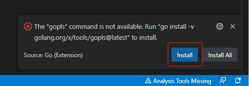

# Golang开发环境搭建

## 课程要点

1. 了解云开发环境
2. 下载安装Golang
3. 配置Golang常用环境变量
4. 安装Golang开发相关的IDE

## 云开发环境

如果你想要快速参与开发与学习，可以直接使用云开发环境， 而不用手动进行本章节后续的配置。

以下是常见的云开发环境，直接点击对应图标就可以在对应的云开发环境中打开本项目的示例代码进行在线开发、运行和调试。

### Github Codespaces

[](https://codespaces.new/go-book/go-programming-book-code)

### Gitpod

[](https://gitpod.io/#https://github.com/go-book/go-programming-book-code)

## 本地开发环境

### 开发环境说明

#### Golang版本

`go1.21.3`

### 安装Golang

首先我们访问Golang的[官网](https://go.dev/dl/)，根据我们当前的操作系统和CPU架构下载对应的最新版Golang安装包。

常见安装包名称如下：

- Linux： go`Go版本号`.linux-`CPU架构`.tar.gz
- Windows：go`Go版本号`.windows-`CPU架构`.msi
- macOS：go`Go版本号`.darwin-`CPU架构`.pkg

#### Linux

如果是Linux操作系统，我们可以使用以下命令下载并进行解压：

```bash
wget https://go.dev/dl/go1.21.3.linux-amd64.tar.gz
tar -C /usr/local -xzf go1.21.3.linux-amd64.tar.gz
```

安装完毕之后，在`$HOME/.profile`文件的末尾加上下面这一行配置，使我们能够在任何地方直接使用Golang相关的命令。

其中`$HOME/.profile`是针对当前用户的配置，如果你需要配置为系统中所有用户都可以直接使用，则直接修改`/etc/profile`文件。

```bash
export PATH=$PATH:/usr/local/go/bin
```

上述配置修改完毕之后，使用`source`命令可以令其立即生效，否则只有在重新登录终端时才会生效。

```bash
source $HOME/.profile
```

如果你刚才是修改了全局配置`/etc/profile`文件，则应该使用以下命令

```bash
source /etc/profile
```

#### Windows

如果是Windows操作系统，我们下载好`.msi`后缀的安装包后，直接双击进行安装即可，
操作非常简单，而且安装程序会自动帮我们配置相关的环境变量。

#### macOS

在macOS中，我们下载好`.pkg`后缀的安装包后，将其安装到`/usr/local/go`目录下即可。

#### 验证安装

以上我们就安装好Golang的基本环境了，我们可以使用以下命令打印当前Golang的版本来验证其是否安装成功

```bash
go version
```

## Golang环境变量

以下是比较常见的Golang环境变量信息，我们可以通过`go env`命令来查看以下环境变量的最新值。

### GOROOT

表示当前系统中Golang安装的根目录

### GOPATH

表示当前系统中Golang工作目录的根目录，一般在安装完Golang后我们就会指定好我们的工作目录，
后续我们所有的项目都会放在这个目录的`src`子目录中。

### GOOS

当前默认的目标编译系统

### GOARCH

当前默认的目标编译架构

### GOPROXY

第三方依赖包的代理服务器，如果你访问Golang官方的代理服务器比较慢，可以修改为国内的代理服务器，比如`https://goproxy.cn`

### GO111MODULE

表示是否启用Go Module作为默认的包管理工具，Go Module在`go1.11`引入，并在`go1.16`以后的版本默认启用

### GOMODCACHE

表示存放第三方依赖包的本地缓存目录

### GOCACHE

表示存放Golang项目编译过程中临时产物的目录，用于后续编译的复用

### 更多环境变量

我们可以通过以下命令查看当前Golang支持的所有环境变量的信息：

```bash
go help environment
```

## 安装IDE

### Goland

Goland是JetBrains公司出品的Golang开发IDE，这是一个收费产品，十分强大易用，目前支持30天免费试用，
直接下载安装即可，会自动识别当前安装的Golang。

下载地址如下：[https://www.jetbrains.com/go/download](https://www.jetbrains.com/go/download)

### VSCode

VSCode是微软出品的一款开源免费的开发工具，通过其强大的插件系统可以支持几乎所有编程语言的开发。

下载地址如下：[https://code.visualstudio.com](https://code.visualstudio.com)

安装完VSCode之后，需要进入VSCode的扩展商店，安装`golang.Go`插件，提供编译、调试和代码提示等功能。

如下图所示，找到我们所需的插件，直接安装即可


插件安装完毕后，可能会提示我们安装缺失的工具，直接按照提示逐个点击安装即可。

如果因为网络原因出现安装失败，可进行反复重试安装，或者将[GOPROXY](#goproxy)环境变量设置为国内的代理服务器后再次重试安装。



上述工具全部安装好之后，整个环境就配置好了，可以直接打开项目进行开发调试了。

## 小结

至此，我们就已经有了可以编写、运行和调试Golang项目的完整开发环境了。
无论是云端还是本地的开发环境，都可以很方便的进行Golang项目的开发，按照各自的需求自行选择即可。

按照惯例，接下来让我们开始编写我们的第一个Golang版本的HelloWorld程序吧！