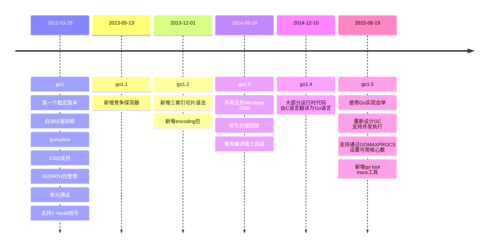
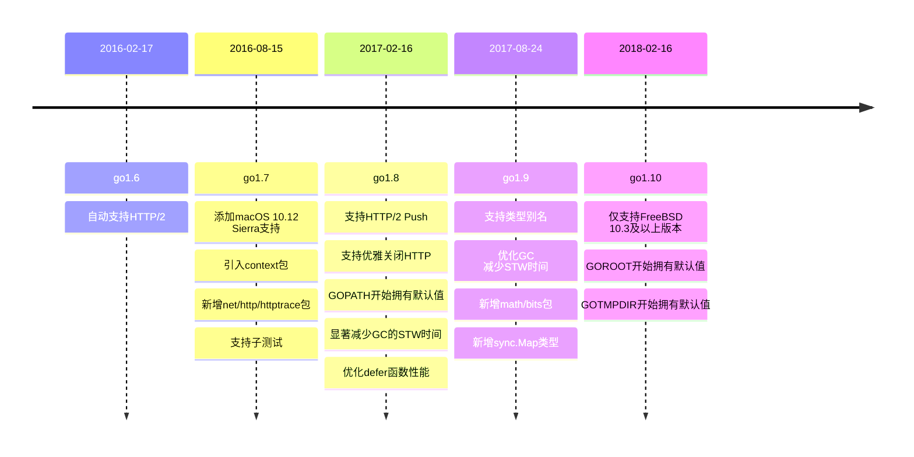
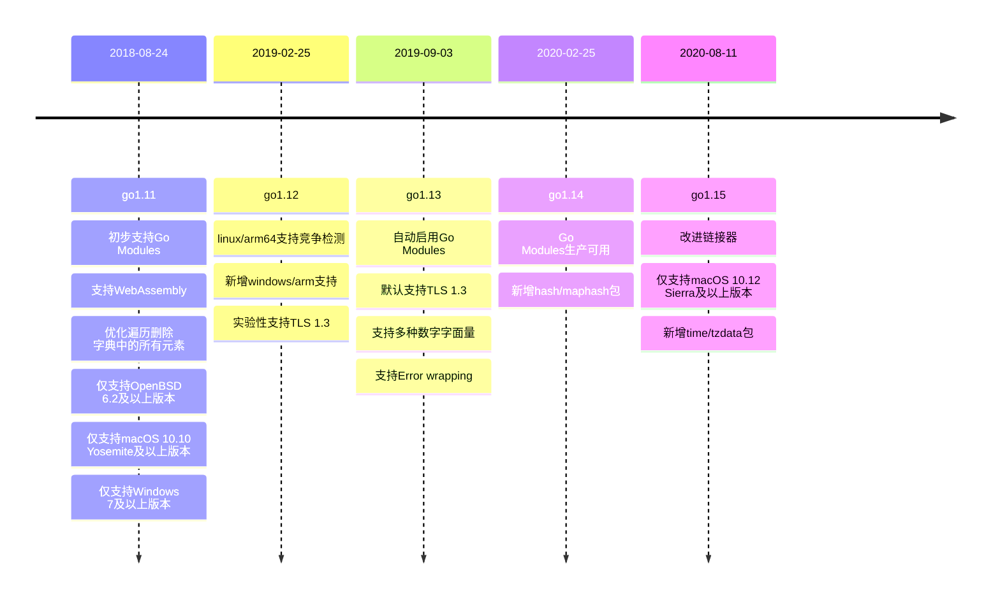
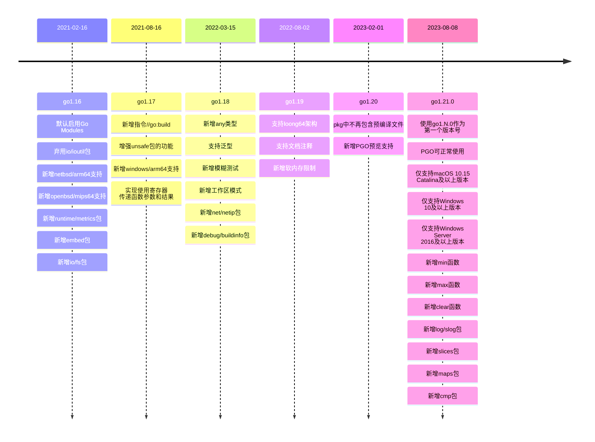

# Golang发布历史

## go1~go1.5

```mermaid
timeline
    2012-03-28: go1: 第一个稳定版本: 自动垃圾回收: goroutine: CGO支持: GOPATH包管理: 单元测试: 支持// +build指令
    2013-05-13: go1.1: 新增竞争探测器
    2013-12-01: go1.2: 新增三索引切片语法: 新增encoding包
    2014-06-18: go1.3: 不再支持Windows 2000: 优化垃圾回收: 重构编译器工具链
    2014-12-10: go1.4: 大部分运行时代码 由C语言翻译为Go语言
    2015-08-19: go1.5: 使用Go实现自举: 重新设计GC 支持并发执行: 支持通过GOMAXPROCS 设置可用核心数: 新增go tool trace工具
```

## go1.6~go1.10

```mermaid
timeline
    2016-02-17: go1.6: 自动支持HTTP/2
    2016-08-15: go1.7: 添加macOS 10.12 Sierra支持: 引入context包: 新增net/http/httptrace包: 支持子测试
    2017-02-16: go1.8: 支持HTTP/2 Push: 支持优雅关闭HTTP: GOPATH开始拥有默认值: 显著减少GC的STW时间: 优化defer函数性能
    2017-08-24: go1.9: 支持类型别名: 优化GC 减少STW时间: 新增math/bits包: 新增sync.Map类型
    2018-02-16: go1.10: 仅支持FreeBSD 10.3及以上版本: GOROOT开始拥有默认值: GOTMPDIR开始拥有默认值
```

## go1.11~go1.15

```mermaid
timeline
    2018-08-24: go1.11: 初步支持Go Modules: 支持WebAssembly: 优化遍历删除 字典中的所有元素: 仅支持OpenBSD 6.2及以上版本: 仅支持macOS 10.10 Yosemite及以上版本: 仅支持Windows 7及以上版本
    2019-02-25: go1.12: linux/arm64支持竞争检测: 新增windows/arm支持: 实验性支持TLS 1.3
    2019-09-03: go1.13: 自动启用Go Modules: 默认支持TLS 1.3: 支持多种数字字面量: 支持Error wrapping
    2020-02-25: go1.14: Go Modules生产可用: 新增hash/maphash包
    2020-08-11: go1.15: 改进链接器: 仅支持macOS 10.12 Sierra及以上版本: 新增time/tzdata包
```

## go1.16~latest

```mermaid
timeline
    2021-02-16: go1.16: 默认启用Go Modules: 弃用io/ioutil包: 新增netbsd/arm64支持: 新增openbsd/mips64支持: 新增runtime/metrics包: 新增embed包: 新增io/fs包
    2021-08-16: go1.17: 新增指令//go#58;build: 增强unsafe包的功能: 新增windows/arm64支持: 实现使用寄存器 传递函数参数和结果
    2022-03-15: go1.18: 新增any类型: 支持泛型: 新增模糊测试: 新增工作区模式: 新增net/netip包: 新增debug/buildinfo包
    2022-08-02: go1.19: 支持loong64架构: 支持文档注释: 新增软内存限制
    2023-02-01: go1.20: pkg中不再包含预编译文件: 新增PGO预览支持
    2023-08-08: go1.21.0: 使用go1.N.0作为 第一个版本号: PGO可正常使用: 仅支持macOS 10.15 Catalina及以上版本: 仅支持Windows 10及以上版本: 仅支持Windows Server 2016及以上版本: 新增min函数: 新增max函数: 新增clear函数: 新增log/slog包: 新增slices包: 新增maps包: 新增cmp包
```